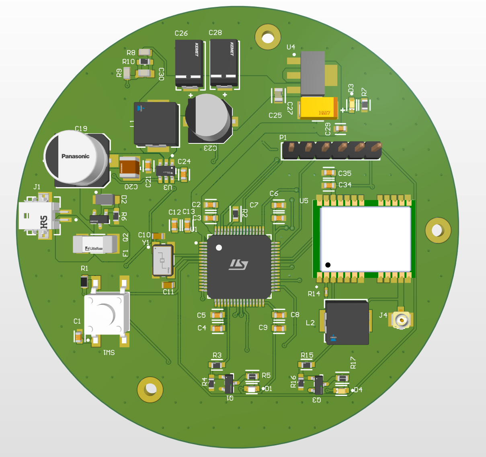

# GPS Tracker PCB Project

## Overview

The GPS Tracker PCB project is a high-performing, reliable hardware solution designed for the tracking of goods in transit. The board is installed in a truck and keeps track of the state of parcels in real-time. The board comes equipped with an STM32L431RCT6 microcontroller, a SIM800L GSM module, and a GY-NEO6M GPS module. It communicates the live updates to a marketplace application, providing essential data for accurate tracking and ensuring the security of the shipments.

## Features

- **STM32L431RCT6 Microcontroller:** The heart of the device, handling all computation and control routines.
- **SIM800L GSM Module:** Enables connectivity to the GSM cellular network, facilitating data communication between the device and the marketplace application.
- **GY-NEO6M GPS Module:** Provides real-time GPS data for tracking the location of the vehicle and, by extension, the state of the parcels.

## Setup and Installation

The installation of this PCB requires professional guidance to ensure the device's optimal operation and the safety of your vehicle. Detailed installation instructions will be provided with the product package, as well as a link to online tutorials and resources. Ensure all connections are securely fixed, and proper insulation is provided to avoid any possible damage.

## Usage

Once installed, the GPS Tracker PCB will automatically start tracking the status of the parcels and transmitting the data to the linked marketplace application. Ensure the GSM module is properly registered to a network for seamless data transmission.

## Contact Information

For further information, support, or if you have any questions or suggestions, please do not hesitate to reach out to me email: feodosiy2404@gmail.com
